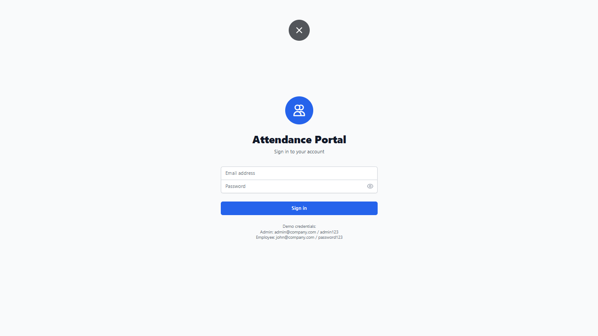
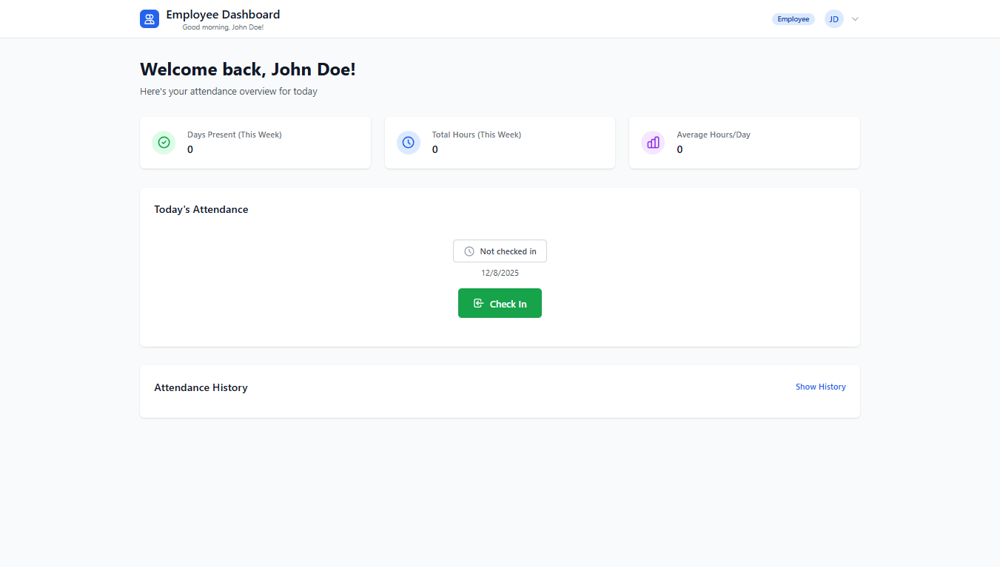
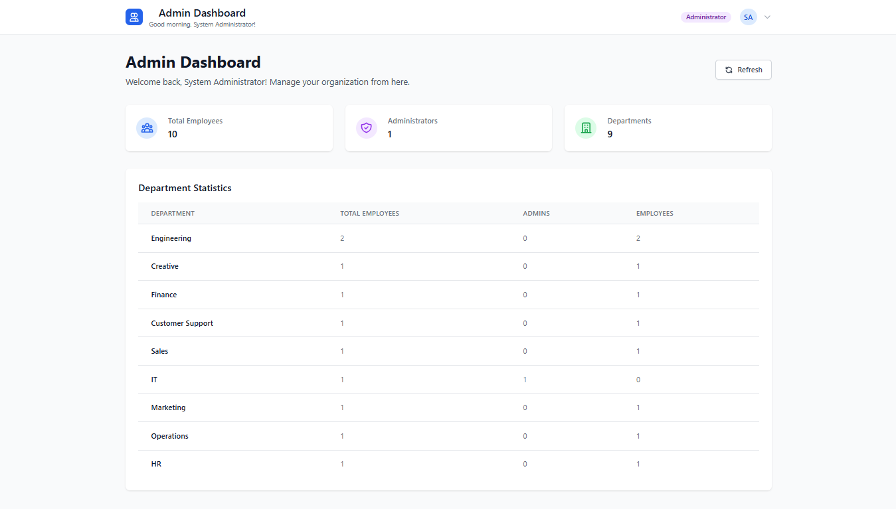
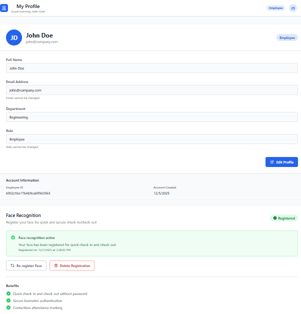
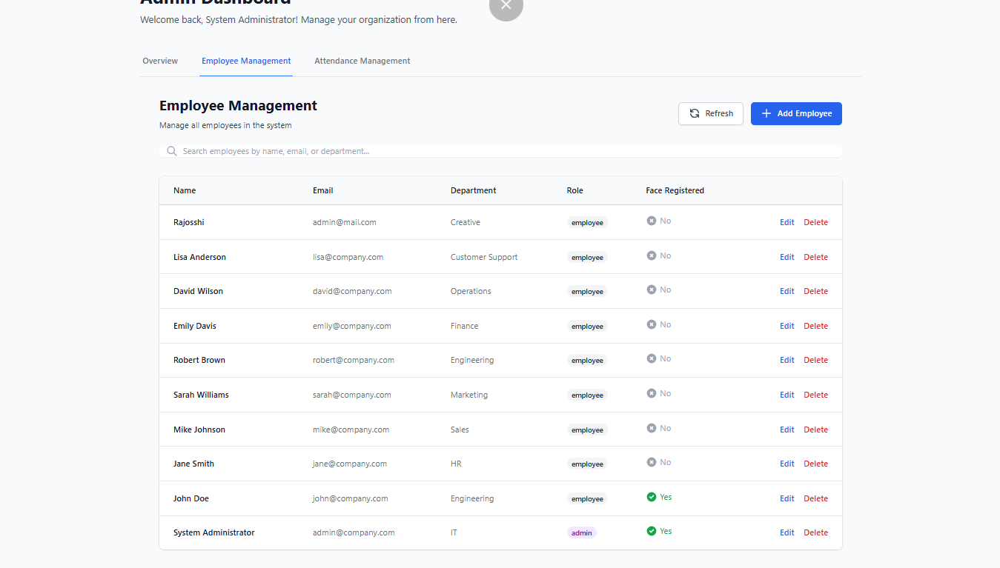
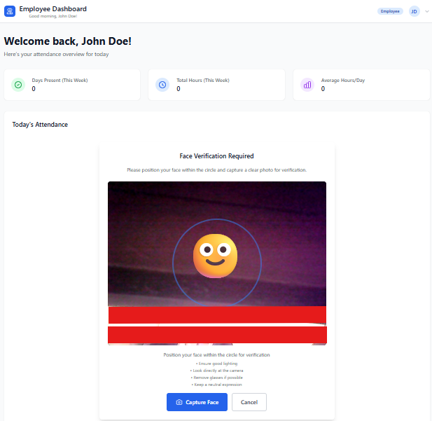

# Employee Attendance Portal

<div align="center">


**A modern, AI-powered employee attendance management system with facial recognition**

[Features](#-features) • [Tech Stack](#-tech-stack) • [Installation](#-installation) • [Usage](#-usage) • [API Documentation](#-api-documentation) • [Author](#-author)

</div>

---

## 📋 Overview

The **Employee Attendance Portal** is a comprehensive, full-stack web application designed to streamline employee attendance tracking and management. Built with cutting-edge technologies, it features AI-powered facial recognition for secure and convenient check-in/check-out operations, making it ideal for modern workplaces.

### Key Highlights

- ✨ **Face Recognition**: AI-powered facial recognition using DeepFace for touchless attendance
- 🔐 **Secure Authentication**: JWT-based authentication with role-based access control
- 📊 **Real-time Dashboard**: Interactive dashboards for employees and administrators
- 📈 **Analytics & Reports**: Comprehensive attendance reports and data export functionality
- 🎨 **Modern UI/UX**: Beautiful, responsive interface built with Next.js and Tailwind CSS
- 🚀 **Production Ready**: Complete with security middleware, rate limiting, and error handling

---

## ✨ Features

### For Employees
- **Quick Check-In/Check-Out**: Mark attendance with a single click or using facial recognition
- **Personal Dashboard**: View attendance history, total hours worked, and statistics
- **Profile Management**: Update personal information and register facial biometrics
- **Attendance History**: Detailed view of past attendance records with filtering options

### For Administrators
- **Employee Management**: Create, update, and manage employee accounts
- **Attendance Oversight**: Monitor all employee attendance in real-time
- **Advanced Reports**: Generate and export attendance reports in Excel format
- **Department Management**: Organize employees by departments
- **Role-Based Access**: Assign different access levels (Admin, Manager, Employee)

### Technical Features
- **Facial Recognition**: DeepFace-powered ML service for secure biometric authentication
- **RESTful API**: Well-structured backend API with comprehensive error handling
- **Data Security**: Password hashing, JWT tokens, helmet security headers
- **Rate Limiting**: Protection against brute force attacks
- **Database Optimization**: Indexed queries for optimal performance
- **Responsive Design**: Works seamlessly on desktop, tablet, and mobile devices

---

## 🛠 Tech Stack

### Frontend
- **Framework**: Next.js 14.x (React 18.x)
- **Styling**: Tailwind CSS
- **UI Components**: Heroicons, Lucide React
- **Form Handling**: React Hook Form
- **HTTP Client**: Axios
- **State Management**: React Context API
- **Notifications**: React Hot Toast

### Backend
- **Runtime**: Node.js
- **Framework**: Express.js
- **Database**: MongoDB with Mongoose ODM
- **Authentication**: JWT (JSON Web Tokens)
- **Security**: Helmet, CORS, bcryptjs, express-rate-limit
- **File Handling**: Multer
- **Data Export**: ExcelJS

### Face Recognition Service
- **Framework**: FastAPI (Python)
- **ML Library**: DeepFace (TensorFlow/Keras backend)
- **Computer Vision**: OpenCV, NumPy, Pillow
- **Model**: InsightFace (buffalo_l)
- **Server**: Uvicorn

### Database
- **Primary Database**: MongoDB Atlas / Local MongoDB
- **Schema Validation**: Mongoose with validation rules
- **Indexing**: Optimized for query performance

---

## 📦 Installation

### Prerequisites

Before you begin, ensure you have the following installed:
- **Node.js** (v16.0.0 or higher)
- **Python** (v3.8 or higher)
- **MongoDB** (v6.0 or higher) - Local installation or MongoDB Atlas account
- **Git** (for cloning the repository)

### Step 1: Clone the Repository

```bash
git clone https://github.com/PravakarDas/Employee-Attendence-Portal.git
cd Employee-Attendence-Portal
```

### Step 2: Backend Setup

```bash
cd backend

# Install dependencies
npm install

# Create environment file
copy .env.example .env

# Edit .env file with your configuration
# Required variables:
# - MONGODB_URI: Your MongoDB connection string
# - JWT_SECRET: A secure random string
# - PORT: Backend server port (default: 5000)
```

**Backend Environment Variables** (`.env`):
```env
PORT=5000
MONGODB_URI=mongodb://localhost:27017/attendance_portal
NODE_ENV=development
JWT_SECRET=your_super_secure_jwt_secret_key_change_this
JWT_EXPIRE=24h
BCRYPT_SALT_ROUNDS=12
```

### Step 3: Frontend Setup

```bash
cd ../frontend

# Install dependencies
npm install

# The frontend will connect to http://localhost:5000 by default
```

### Step 4: Face Recognition Service Setup

```bash
cd ../face-service

# Create virtual environment (recommended)
python -m venv venv

# Activate virtual environment
# Windows:
venv\Scripts\activate
# Linux/Mac:
# source venv/bin/activate

# Install dependencies
pip install -r requirements.txt

# Create environment file
copy .env.example .env

# Edit .env file if needed (defaults should work)
```

**Face Service Environment Variables** (`.env`):
```env
SERVICE_HOST=0.0.0.0
SERVICE_PORT=5001
INSIGHTFACE_MODEL=buffalo_l
DETECTION_SIZE=640
FACE_MATCH_THRESHOLD=0.45
EXECUTION_PROVIDER=CPUExecutionProvider
```

### Step 5: Database Seeding (Optional)

Seed the database with sample data for testing:

```bash
cd ../database-seed

# Install dependencies
npm install

# Run the seed script
npm run seed

# This creates:
# - Admin account: admin@company.com / admin123
# - Sample employees with test data
```

---

## 🚀 Usage

### Starting All Services

#### Option 1: Manual Start (Recommended for Development)

**Terminal 1 - Backend:**
```bash
cd backend
npm run dev
# Server will start on http://localhost:5000
```

**Terminal 2 - Frontend:**
```bash
cd frontend
npm run dev
# Application will start on http://localhost:3000
```

**Terminal 3 - Face Service:**
```bash
cd face-service
# Activate virtual environment first
venv\Scripts\activate
# Then start the service
python app.py
# Service will start on http://localhost:5001
```

#### Option 2: Using Start Scripts (Windows)

**PowerShell:**
```powershell
.\dump\start-all.ps1
```

**Command Prompt:**
```cmd
.\dump\start-all.bat
```

### Default Credentials

After seeding the database:

**Admin Account:**
- Email: `admin@company.com`
- Password: `admin123`

**Sample Employee Account:**
- Email: `john@company.com`
- Password: `password123`

### Accessing the Application

1. Open your browser and navigate to `http://localhost:3000`
2. Log in with the credentials above
3. Explore the dashboard and features

---

## 📱 Application Structure

```
Employee-Attendence-Portal/
├── backend/                 # Express.js API server
│   ├── src/
│   │   ├── controllers/    # Request handlers
│   │   ├── middleware/     # Auth & validation middleware
│   │   ├── models/         # MongoDB schemas
│   │   ├── routes/         # API route definitions
│   │   └── utils/          # Helper functions
│   └── package.json
│
├── frontend/               # Next.js application
│   ├── src/
│   │   ├── components/    # React components
│   │   ├── context/       # React context providers
│   │   ├── hooks/         # Custom React hooks
│   │   ├── pages/         # Next.js pages
│   │   ├── services/      # API service functions
│   │   └── styles/        # Global styles
│   └── package.json
│
├── face-service/          # Python FastAPI ML service
│   ├── app.py            # Main application
│   ├── requirements.txt  # Python dependencies
│   └── README.md
│
└── database-seed/        # Database seeding scripts
    ├── seedData.js       # Comprehensive seed data
    └── package.json
```

---

## 🔌 API Documentation

### Base URL
```
http://localhost:5000/api
```

### Authentication Endpoints

#### Login
```http
POST /api/auth/login
Content-Type: application/json

{
  "email": "user@company.com",
  "password": "password123"
}
```

#### Get Profile
```http
GET /api/auth/profile
Authorization: Bearer <token>
```

### Attendance Endpoints

#### Check In
```http
POST /api/attendance/checkin
Authorization: Bearer <token>
```

#### Check Out
```http
POST /api/attendance/checkout
Authorization: Bearer <token>
```

#### Get My Attendance
```http
GET /api/attendance/my-attendance?startDate=2024-01-01&endDate=2024-12-31
Authorization: Bearer <token>
```

### Employee Endpoints (Admin Only)

#### Get All Employees
```http
GET /api/employees
Authorization: Bearer <token>
```

#### Create Employee
```http
POST /api/employees
Authorization: Bearer <token>
Content-Type: application/json

{
  "name": "John Doe",
  "email": "john@company.com",
  "password": "password123",
  "role": "employee",
  "department": "Engineering"
}
```

### Face Recognition Endpoints

#### Register Face
```http
POST /api/face/register
Authorization: Bearer <token>
Content-Type: application/json

{
  "image": "base64_encoded_image_string"
}
```

#### Verify Face
```http
POST /api/face/verify
Authorization: Bearer <token>
Content-Type: application/json

{
  "image": "base64_encoded_image_string"
}
```

---

## 🔒 Security Features

- **Password Hashing**: bcryptjs with configurable salt rounds
- **JWT Authentication**: Secure token-based authentication with expiration
- **Helmet**: HTTP security headers
- **CORS**: Configurable cross-origin resource sharing
- **Rate Limiting**: Protection against brute force attacks
- **Input Validation**: Express-validator for request validation
- **Role-Based Access Control**: Different permissions for admin, manager, and employee
- **Secure Face Data**: Face embeddings stored securely and excluded by default

---

## 🎨 Screenshots

### Login Page
Modern and secure login interface with form validation.  


### Employee Dashboard
Real-time attendance tracking with statistics and quick actions.  


### Admin Panel
Comprehensive management tools for attendance and employee oversight.  


### Face Registration
Intuitive interface for registering facial biometrics.  


### Employment Management (Admin)
Tools for managing employee records efficiently.  


### Face Recognition Check-in / Checkout
Seamless attendance process using facial recognition.  


---


## 🧪 Testing

### Backend Testing
```bash
cd backend
npm test
```

### Frontend Testing
```bash
cd frontend
npm run lint
```

### Face Service Testing
```bash
cd face-service
# Test the health endpoint
curl http://localhost:5001/health
```

---

## 📊 Database Schema

### Employee Collection
```javascript
{
  _id: ObjectId,
  name: String,
  email: String (unique),
  password: String (hashed),
  role: String (employee|admin|manager),
  department: String,
  faceEmbedding: [Number],
  faceRegisteredAt: Date,
  createdAt: Date,
  updatedAt: Date
}
```

### Attendance Collection
```javascript
{
  _id: ObjectId,
  employee_id: ObjectId (ref: Employee),
  check_in: Date,
  check_out: Date,
  total_hours: Number,
  date: Date,
  notes: String,
  status: String (active|completed|absent|leave),
  createdAt: Date,
  updatedAt: Date
}
```

---

## 🚢 Deployment

### Backend Deployment (Railway/Render/Heroku)

1. Set environment variables in your hosting platform
2. Ensure MongoDB Atlas connection string is configured
3. Deploy the backend directory
4. Note the deployed URL for frontend configuration

### Frontend Deployment (Vercel/Netlify)

1. Update API base URL in `frontend/src/services/api.js`
2. Connect your Git repository
3. Deploy with default Next.js settings

### Face Service Deployment (Railway/Render)

1. Deploy the face-service directory
2. Ensure Python dependencies are installed
3. Update the backend environment with face service URL

---

## 🤝 Contributing

Contributions are welcome! Please follow these steps:

1. Fork the repository
2. Create a feature branch (`git checkout -b feature/AmazingFeature`)
3. Commit your changes (`git commit -m 'Add some AmazingFeature'`)
4. Push to the branch (`git push origin feature/AmazingFeature`)
5. Open a Pull Request

---

## 📝 License

This project is licensed under the ISC License. See the [LICENSE](LICENSE) file for details.

---

## 👨‍💻 Author

**PRAVAKAR DAS**

- GitHub: [@PravakarDas](https://github.com/PravakarDas)
- Project Link: [Employee-Attendence-Portal](https://github.com/PravakarDas/Employee-Attendence-Portal)

---

## 🙏 Acknowledgments

- [Next.js](https://nextjs.org/) - The React framework for production
- [Express.js](https://expressjs.com/) - Fast, unopinionated web framework
- [FastAPI](https://fastapi.tiangolo.com/) - Modern Python web framework
- [DeepFace](https://github.com/serengil/deepface) - Face recognition library
- [MongoDB](https://www.mongodb.com/) - NoSQL database
- [Tailwind CSS](https://tailwindcss.com/) - Utility-first CSS framework

---

## 📞 Support

If you encounter any issues or have questions:

1. Check the [Issues](https://github.com/PravakarDas/Employee-Attendence-Portal/issues) page
2. Create a new issue with detailed information
3. Contact the author through GitHub

---

## ⚠️ Known Limitations

### Current Version Constraints

#### Performance & Scalability
- **Face Recognition Processing**: CPU-based face recognition can be slow for large-scale deployments. Processing time increases with the number of registered users.
- **Database Performance**: MongoDB queries may slow down with thousands of attendance records without proper indexing optimization.
- **Concurrent Users**: The system is optimized for small to medium-sized organizations (up to 500 employees). Large-scale deployments may require load balancing.

#### Facial Recognition
- **Lighting Conditions**: Face recognition accuracy depends heavily on consistent lighting. Poor lighting or shadows can reduce match accuracy.
- **Camera Quality**: Low-resolution cameras may affect face detection and recognition accuracy.
- **Face Angle**: Works best with frontal face images. Side profiles or tilted faces may not be recognized accurately.
- **Multiple Faces**: The system currently processes one face at a time. Multiple faces in frame may cause confusion.
- **Face Changes**: Significant changes in appearance (glasses, facial hair, aging) may require re-registration.

#### Technical Limitations
- **Real-time Updates**: Dashboard doesn't auto-refresh. Users need to manually reload to see latest updates.
- **Offline Support**: No offline functionality. Requires continuous internet connection.
- **File Size Limits**: Face image uploads are limited to prevent server overload.
- **Browser Compatibility**: Best performance on modern browsers (Chrome, Firefox, Edge). May have issues with older browsers.

#### Feature Gaps
- **No Leave Management**: System tracks attendance but doesn't handle leave requests, vacation days, or sick leave.
- **Limited Reporting**: Export functionality is basic. Advanced analytics and custom report generation not available.
- **No Shift Management**: Assumes standard working hours. No support for multiple shifts or flexible schedules.
- **Single Location**: No support for multiple office locations or remote work tracking.
- **No Notifications**: No email or push notifications for attendance events.
- **Manual Attendance Correction**: Admin must manually fix incorrect check-ins. No automated correction system.

#### Security Considerations
- **Face Data Storage**: Face embeddings are stored in database. Additional encryption recommended for sensitive deployments.
- **Session Management**: Basic JWT token implementation. Advanced session management features not included.
- **Audit Logging**: Limited audit trail functionality for tracking system changes.
- **Two-Factor Authentication**: Not currently implemented.

#### Development & Testing
- **Test Coverage**: Limited automated tests. Manual testing recommended for critical features.
- **Documentation**: API documentation is basic. Comprehensive Swagger/OpenAPI docs not included.
- **Docker Support**: No containerization setup provided for easy deployment.
- **CI/CD Pipeline**: No automated build, test, or deployment pipeline configured.

#### Data Management
- **Data Retention**: No automated data archival or cleanup policies.
- **Backup & Recovery**: No built-in backup solution. Manual database backups required.
- **Data Export**: Limited to Excel format. No integration with other HR systems.
- **Multi-tenancy**: Single tenant system. Cannot handle multiple organizations in one deployment.

---

## 🗺️ Future Enhancements & Roadmap

### Short-term Goals

#### User Experience Improvements
- [ ] **Real-time Dashboard Updates**: Implement WebSocket connections for live attendance updates
- [ ] **Dark Mode**: Add dark theme support across all pages
- [ ] **Enhanced Notifications**: Email and in-app notifications for check-in reminders and attendance anomalies
- [ ] **Accessibility (A11y)**: WCAG 2.1 compliance for screen readers and keyboard navigation
- [ ] **Progressive Web App (PWA)**: Add offline support and installable app functionality

#### Feature Additions
- [ ] **Leave Management System**: 
  - Leave request workflow (sick leave, vacation, personal days)
  - Leave balance tracking and carry-forward
  - Manager approval workflow
  - Leave calendar view
- [ ] **Advanced Reporting & Analytics**:
  - Custom date range reports
  - Department-wise attendance analytics
  - Employee productivity insights
  - Attendance trend analysis with charts
  - Automated monthly/weekly report generation
- [ ] **Shift Management**:
  - Multiple shift configurations
  - Flexible working hours support
  - Shift scheduling and rotation
  - Overtime calculation
- [ ] **Geolocation Tracking**:
  - Location-based check-in validation
  - Multi-location support for distributed offices
  - Geo-fencing for attendance verification

#### Technical Improvements
- [ ] **GPU Acceleration**: CUDA support for face recognition to improve processing speed
- [ ] **Face Recognition Enhancements**:
  - Anti-spoofing detection (prevent photo/video spoofing)
  - Multiple face angles support
  - Better low-light performance
  - Face mask detection and recognition
- [ ] **Testing Suite**:
  - Unit tests for backend services (Jest/Mocha)
  - Integration tests for API endpoints
  - E2E tests for frontend (Cypress/Playwright)
  - Automated testing in CI pipeline
- [ ] **Performance Optimization**:
  - Database query optimization and advanced indexing
  - Caching layer (Redis) for frequently accessed data
  - Image compression and optimization
  - Lazy loading and code splitting

### Mid-term Goals

#### Platform Expansion
- [ ] **Mobile Applications**:
  - Native Android app (Kotlin/React Native)
  - Native iOS app (Swift/React Native)
  - Mobile-first face recognition
  - Push notifications for mobile
  - QR code check-in as alternative
- [ ] **Multi-language Support (i18n)**:
  - English, Spanish, French, German, Hindi, Chinese
  - RTL language support (Arabic, Hebrew)
  - Dynamic language switching
  - Localized date/time formats

#### Advanced Features
- [ ] **Biometric Integration**:
  - Fingerprint scanner support
  - RFID card reader integration
  - QR code/barcode scanning
  - Multi-factor biometric authentication
- [ ] **AI-Powered Features**:
  - Predictive analytics for attendance patterns
  - Anomaly detection for suspicious activities
  - Smart scheduling recommendations
  - Automated report insights with ML
- [ ] **Workflow Automation**:
  - Automated late arrival notifications
  - Smart overtime calculations
  - Auto-approval rules for leave requests
  - Integration with payroll systems
- [ ] **Communication Features**:
  - In-app messaging system
  - Team announcements and bulletins
  - Emergency broadcast messages
  - Integration with Slack/Microsoft Teams

#### Enterprise Features
- [ ] **Multi-tenancy Support**: 
  - Support multiple organizations in single deployment
  - Tenant isolation and data security
  - Custom branding per tenant
  - Separate billing and usage tracking
- [ ] **Advanced Admin Controls**:
  - Granular permission system
  - Custom roles and access levels
  - Audit logs for all system actions
  - Compliance reporting (GDPR, SOC2)
- [ ] **HR System Integration**:
  - API integration with popular HRMS (SAP, Workday, BambooHR)
  - Payroll system integration (ADP, Gusto)
  - Calendar integration (Google Calendar, Outlook)
  - Single Sign-On (SSO) support (OAuth, SAML)

### Long-term Vision

#### Scalability & Architecture
- [ ] **Microservices Architecture**: Break down monolith into independent services
- [ ] **Kubernetes Deployment**: Container orchestration for auto-scaling
- [ ] **Load Balancing**: Multi-region deployment with CDN integration
- [ ] **Event-Driven Architecture**: Apache Kafka/RabbitMQ for async processing
- [ ] **GraphQL API**: Flexible data querying alongside REST APIs

#### Advanced Analytics & AI
- [ ] **Business Intelligence Dashboard**:
  - Custom report builder with drag-and-drop
  - Executive dashboards with KPIs
  - Data visualization with interactive charts
  - Scheduled report delivery
- [ ] **Machine Learning Models**:
  - Attendance pattern prediction
  - Employee churn risk analysis
  - Optimal shift scheduling recommendations
  - Fraud detection and prevention
- [ ] **Natural Language Processing**:
  - Voice-based attendance commands
  - Chatbot for HR queries
  - Sentiment analysis from employee feedback

#### Blockchain & Security
- [ ] **Blockchain Integration**: Immutable attendance records for compliance
- [ ] **Zero-Knowledge Proofs**: Enhanced privacy for biometric data
- [ ] **End-to-End Encryption**: Secure all sensitive data transmission
- [ ] **Advanced Security**: Penetration testing, bug bounty program

#### Ecosystem Development
- [ ] **Public API**: Well-documented RESTful API for third-party integrations
- [ ] **SDK Development**: JavaScript, Python, Java SDKs for easy integration
- [ ] **Plugin System**: Allow custom extensions and modules
- [ ] **Marketplace**: Community-driven plugins and themes
- [ ] **White-label Solution**: Fully customizable version for resellers

#### Compliance & Standards
- [ ] **Industry Certifications**: ISO 27001, SOC 2 Type II compliance
- [ ] **Regional Compliance**: GDPR (EU), CCPA (California), HIPAA (Healthcare)
- [ ] **Accessibility**: WCAG 2.2 AAA compliance
- [ ] **Industry-Specific Versions**: Healthcare, Manufacturing, Retail, Remote work

---

<div align="center">

**Made with ❤️ by PRAVAKAR DAS**

⭐ Star this repository if you find it helpful!

</div>
